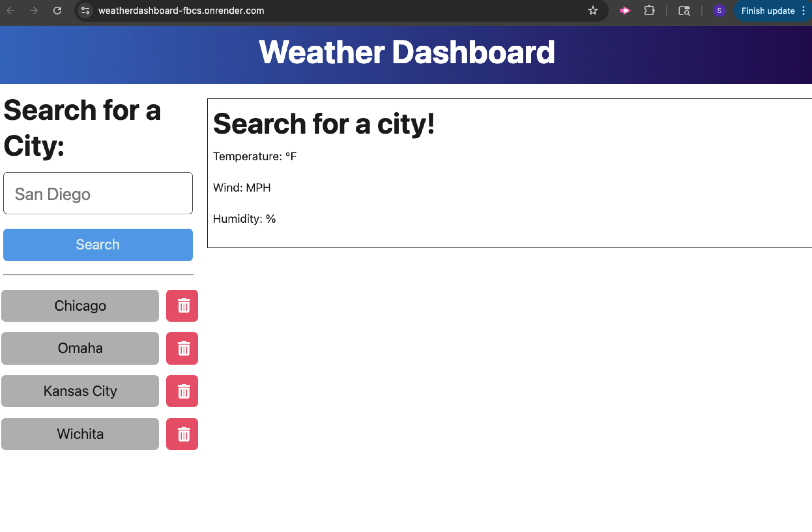

# Weather Dashboard

## Description

The Weather Dashboard is a full-stack TypeScript application that lets users search any city and view the current weather along with a 5-day forecast. Creating this application was helpful in improving my skills in working with APIs, building full-stack applications, and deploying multi-service apps.

## Table of Contents

- [Installation](#installation)
- [Usage](#usage)
- [Features](#features)
- [Credits](#credits)
- [License](#license)

## Installation

Follow these steps to install and run the project locally:

1. **Clone the repository**
   ```bash
   git clone https://github.com/SSgrandslam7/weatherDashboard.git
   cd weatherDashboard
   ```

2. **Install backend dependencies**
   ```bash
   cd server
   npm install
   ```

3. **Install frontend dependencies**
   ```bash
   cd ../client
   npm install
   ```

4. **Create your environment variables**

   In `server/.env`:
   ```
   API_KEY=your_openweathermap_api_key
   PORT=3001
   ```

   In `client/.env`:
   ```
   VITE_API_URL=http://localhost:3001/api/weather
   ```

5. **Run both the client and server**
   ```bash
   cd ..
   npm run start:dev
   ```

## Usage

Type a city into the search bar to receive the current weather and a 5-day forecast. Previous searches are saved and can be clicked again.

### Example:



## Features

- Search current weather by city
- Displays temperature, humidity, wind speed, weather icon, and description
- 5-day weather forecast
- Saves search history
- Uses OpenWeatherMap API
- Built with TypeScript + Vite on frontend
- Express + Node backend with TypeScript
- Deployed as multi-service app on Render

## Credits

- [OpenWeatherMap API](https://openweathermap.org/api) – for weather data
- [Render](https://render.com/) – for deployment hosting

## License

MIT License (c) [2025] [Stephen Schier]